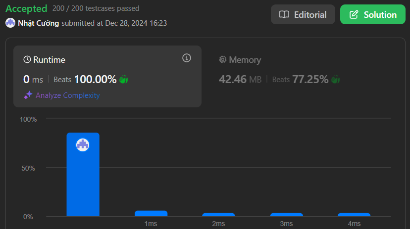

# Best Time to Buy and Sell Stock

## Problem Description

You are given an integer array `prices` where `prices[i]` is the price of a given stock on the `i^th` day.

On each day, you may decide to buy and/or sell the stock. You can only hold at most one share of the stock at any time. However, you can buy it then immediately sell it on the same day.

Find and return the `maximum profit` you can achieve.

### Challenge

To get accepted, you need to:
1. Write a function that takes an array of stock `prices` as input
2. Find the `maximum profit` possible by performing multiple transactions
3. Return the `maximum profit` after completing all possible profitable transactions

Note: You must ensure that:
- You can only hold one share of stock at a time
- You must sell before you can buy again

## Examples

### Example 1:
```
Input: prices = [7,1,5,3,6,4]
Output: 7
Explanation: Buy on day 2 (price = 1) and sell on day 3 (price = 5), profit = 5-1 = 4.
Then buy on day 4 (price = 3) and sell on day 5 (price = 6), profit = 6-3 = 3.
Total profit is 4 + 3 = 7.
```

### Example 2:
```
Input: prices = [1,2,3,4,5]
Output: 4
Explanation: Buy on day 1 (price = 1) and sell on day 5 (price = 5), profit = 5-1 = 4.
Total profit is 4.
```

### Example 3:
```
Input: prices = [7,6,4,3,1]
Output: 0
Explanation: There is no way to make a positive profit, so we never buy the stock to achieve the maximum profit of 0.
```

## Constraints

- `1 <= prices.length <= 3 * 10^4`
- `0 <= prices[i] <= 10^4`

## Results

### Performance Analysis


### Code Complexity
- Time Complexity: O(n)
- Space Complexity: O(1)

### Stats
- Runtime: 0 ms, faster than 100.00% of C# online submissions
- Memory Usage: 42.46 MB, less than 77.25% of C# online submissions