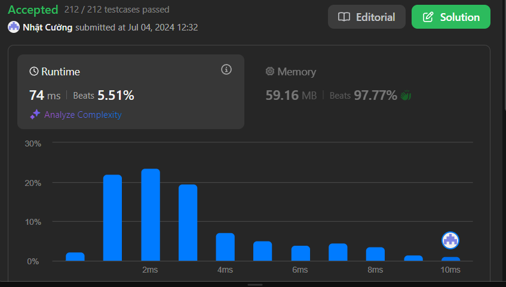

# Best Time to Buy and Sell Stock

## Problem Description

You are given an array `prices` where `prices[i]` is the price of a given stock on the the `i^th^` day.

You want to maximize your profit by choosing a single day to buy one stock and choosing a different day in the future to sell that stock.

Return the maximum profit you can achieve from this transaction. If you cannot achieve any profit, return `0`.
### Challenge

To get accepted, you need to:
1. Write a function that takes an array of stock `prices` as input
2. Find the `maximum profit` possible by choosing one day to buy and a later day to sell
3. Return the `maximum profit` if a profit is possible, otherwise return `0`

Note: You must ensure that:
- You can only hold one share of stock at a time
- You must buy before you can sell
- You can only make one transaction (one buy and one sell)

## Examples

### Example 1:
```
Input: prices = [7,1,5,3,6,4]
Output: 5
Explanation: Buy on day 2 (price = 1) and sell on day 5 (price = 6), profit = 6-1 = 5.
Note that buying on day 2 and selling on day 1 is not allowed because you must buy before you sell.
```

### Example 2:
```
Input: prices = [7,6,4,3,1]
Output: 0
Explanation: In this case, no transactions are done and the max profit = 0.
```

## Constraints

- `1 <= prices.length <= 10^5`
- `0 <= prices[i] <= 10^4`

## Results

### Performance Analysis


### Code Complexity
- Time Complexity: O(n)
- Space Complexity: O(1)

### Stats
- Runtime: 74 ms, faster than 5.51% of C# online submissions
- Memory Usage: 59.16 MB, less than 97.77% of C# online submissions