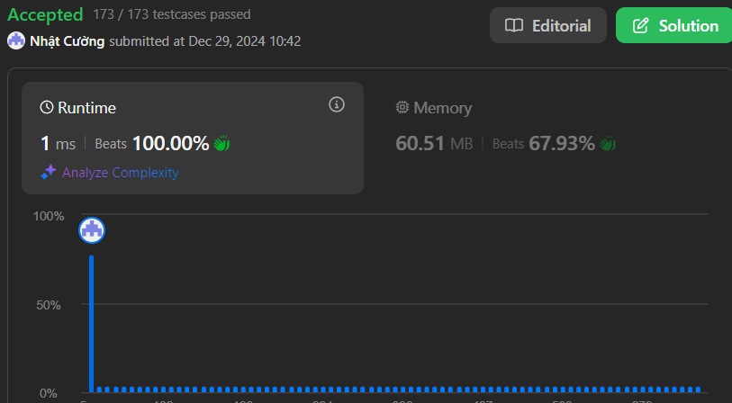

# Best Time to Buy and Sell Stock

## Problem Description

You are given an integer array `nums`. You are initially positioned at the array's first index, and each element in the array represents your maximum jump length at that position.

Return `true` if you can reach the last index, or `false` otherwise.

### Challenge

To get accepted, you need to:
1. Write a function that takes an array of integers `nums` as input.
2. Implement an efficient algorithm to determine whether it is possible to jump from the first index to the last index.
3. Return `true` if you can reach the last index, otherwise return false.


## Examples

### Example 1:
```
Input: nums = [2,3,1,1,4]
Output: true
Explanation: Jump 1 step from index 0 to 1, then 3 steps to the last index.
```

### Example 2:
```
Input: nums = [3,2,1,0,4]
Output: false
Explanation: You will always arrive at index 3 no matter what. Its maximum jump length is 0, which makes it impossible to reach the last index.
```

## Constraints

- `1 <= nums.length <= 3 * 10^4`
- `0 <= nums[i] <= 10^5`

## Results

### Performance Analysis


### Code Complexity
- Time Complexity: O(n)
- Space Complexity: O(1)

### Stats
- Runtime: 1 ms, faster than 100.00% of C# online submissions
- Memory Usage: 60.51 MB, less than 67.93% of C# online submissions