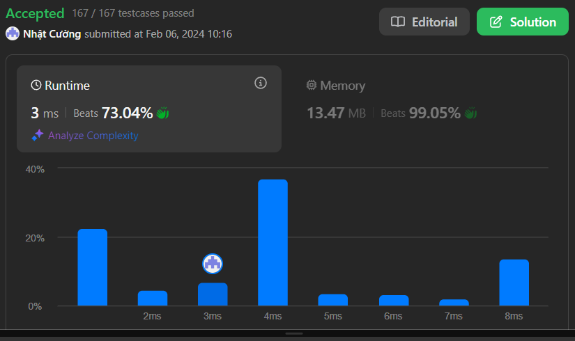

# Remove Duplicates from Sorted Array II

## Problem Description

Given an integer array `nums` sorted in non-decreasing order, remove the duplicates in-place such that each unique element appears at most twice. The relative order of the elements should be kept the same.

Return the number of unique elements in `nums`.

### Challenge

To get accepted, you need to:
1. Modify the array `nums` such that the first `k` elements contain the unique elements in their original order, each appearing at most twice.
2. Return `k` (the number of unique elements).

Note: The remaining elements of `nums` and the array size are not important.

## Custom Judge

The judge will test your solution with the following code:

```java
int[] nums = [...]; // Input array
int[] expectedNums = [...]; // The expected answer with correct length

int k = removeDuplicates(nums); // Calls your implementation

assert k == expectedNums.length;
for (int i = 0; i < k; i++) {
    assert nums[i] == expectedNums[i];
}
```

If all assertions pass, then your solution will be accepted.

## Examples

### Example 1:
```
Input: nums = [1,1,1,2,2,3]
Output: 5, nums = [1,1,2,2,3,_]
Explanation: Your function should return k = 5, with the first five elements of nums being 1, 1, 2, 2, and 3 respectively.
It does not matter what you leave beyond the returned k (hence they are underscores).
```

### Example 2:
```
Input: nums = [0,0,1,1,1,1,2,3,3]
Output: 7, nums = [0,0,1,1,2,3,3,_,_]
Explanation: Your function should return k = 7, with the first seven elements of nums being 0, 0, 1, 1, 2, 3, and 3 respectively.
It does not matter what you leave beyond the returned k (hence they are underscores).
```

## Constraints

- `1 <= nums.length <= 3 * 10⁴`
- `-10^4 <= nums[i] <= 10^4`
- `nums` is sorted in non-decreasing order

## Results

### Performance Analysis


### Code Complexity
- Time Complexity: O(n)
- Space Complexity: O(1)

### Stats
- Runtime: 3 ms, faster than 73.04% of C# online submissions
- Memory Usage: 13.47 MB, less than 99.05% of C# online submissions