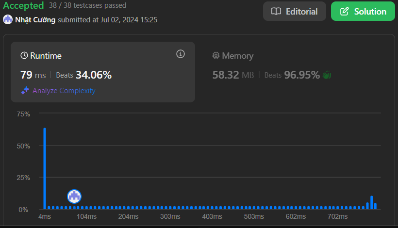

# Rotate Array

## Problem Description

Given an integer array `nums`, rotate the array to the right by `k` steps, where `k` is non-negative.

The challenge is to implement a solution that rotates the elements of the array to the right by k positions, effectively moving each element k steps forward and wrapping around to the beginning when reaching the end.

### Challenge

The key requirements are:
1. Rotate the array in-place if possible
2. Handle different array sizes and rotation steps efficiently 
3. Consider edge cases like when k is larger than array length

## Examples

### Example 1:
```
Input: nums = [1,2,3,4,5,6,7], k = 3
Output: [5,6,7,1,2,3,4]
Explanation:
rotate 1 steps to the right: [7,1,2,3,4,5,6]
rotate 2 steps to the right: [6,7,1,2,3,4,5]
rotate 3 steps to the right: [5,6,7,1,2,3,4]
```

### Example 2:
```
Input: nums = [-1,-100,3,99], k = 2
Output: [3,99,-1,-100]
Explanation:
rotate 1 steps to the right: [99,-1,-100,3]
rotate 2 steps to the right: [3,99,-1,-100]
```

## Solutions

There are several approaches to solve this problem:

1. Using Extra Array (O(n) space)
2. Using Cyclic Replacements (O(1) space)
3. Using Reverse Method (O(1) space)

Here's the implementation of the Reverse Method approach, which is the most space-efficient:

```csharp
public class Solution {
    public void Rotate(int[] nums, int k) {
        k %= nums.Length;
        Reverse(nums, 0, nums.Length - 1);
        Reverse(nums, 0, k - 1);
        Reverse(nums, k, nums.Length - 1);
    }

    private void Reverse(int[] nums, int start, int end) {
        while (start < end) {
            int temp = nums[start];
            nums[start] = nums[end];
            nums[end] = temp;
            start++;
            end--;
        }
    }
}
```

## Constraints

- `1 <= nums.length <= 105`
- `-231 <= nums[i] <= 231 - 1`
- `0 <= k <= 105`

## Complexity Analysis

### Time Complexity
- O(n) where n is the length of the array
- Each element is reversed at most twice

### Space Complexity
- O(1) as we only use a constant amount of extra space

## Results

### Performance Analysis


### Code Complexity
- Time Complexity: O(n)
- Space Complexity: O(1)

### Stats
- Runtime: 79 ms, faster than 34.06% of C# online submissions
- Memory Usage: 58.82 MB, less than 96.95% of C# online submissions